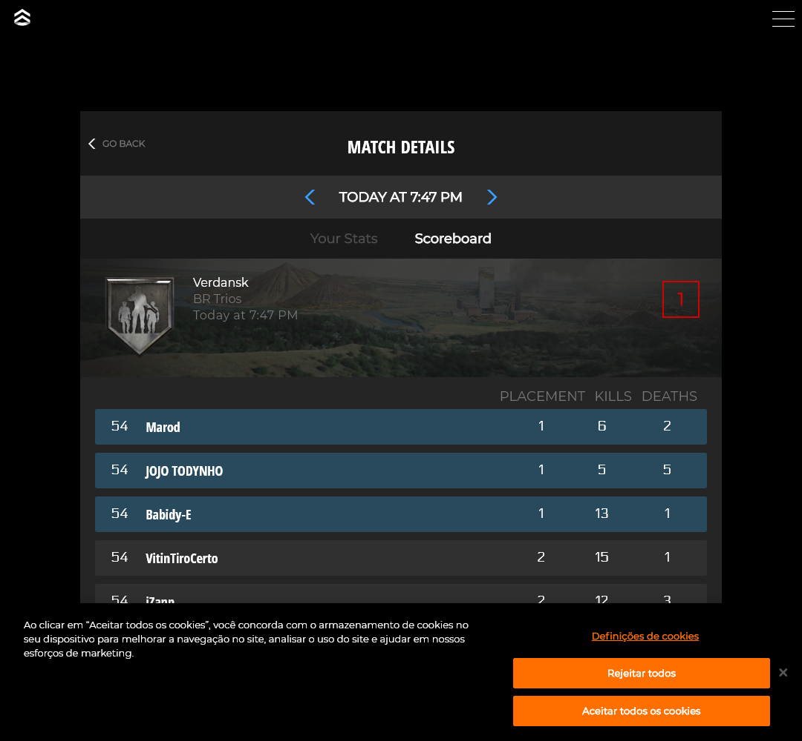

# Cod Puppeteer

Robo que faz login no [Call of Duty profile](https://profile.callofduty.com/cod/login) e retorna informações no console

>documentação do [Puppeteer](https://github.com/puppeteer/puppeteer)

## Instale as dependencias
```
#node
npm install

#yarn
yarn
```

## Iniciar o robo
`
node index.js
`

### .env
```
EMAIL=
PASS=
```


### Retorno do robo no console

```
    Logado com Sucesso
    Acessou a página de recent matches
   
    __ Última partida __
    Ficou em 
    Modo 
    Kills 
    Damage 
    Headshot 
    Morreu n vezes
    Tempo da partida 
```

> Se ganhou a partida
>